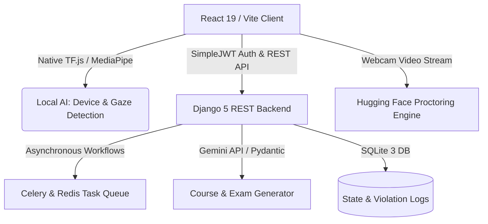

<div align="center">
  
  # 🛡️ QuantumGuard: AI-Powered Learning Companion & Proctoring Suite
  *A unified, next-generation intelligent ecosystem for secure, monitored, and automated course and examination management.*

  [](https://vite.dev/)
  [](https://react.dev/)
  [](https://www.typescriptlang.org/)
  [](https://www.djangoproject.com/)
  [](https://js.tensorflow.org/)

</div>

---

## 🚀 Product Overview

**QuantumGuard** is an advanced technical education suite that serves a dual purpose: it is a highly interactive **AI Learning Companion** for students and a comprehensive **AI-Powered Proctoring & Examination Suite** for faculty.

By combining browser-native neural networks with cloud-based large language models, QuantumGuard enables institutions to deliver personalized coursework, extract video transcripts to generate real-time quizzes, and monitor high-stakes examinations securely without intrusive third-party software.

---

## 🏗️ System Architecture

QuantumGuard leverages a modern, distributed architecture combining local client-side inference with backend AI workflows:



### Key Technologies
*   **Frontend Hub**: Built on **React 19**, **Vite**, **TypeScript**, and **Lucide-React** for a responsive, high-performance UI.
*   **Edge Intelligence**: Client-side object detection (**COCO-SSD**) and face landmark tracking (**MediaPipe Face Mesh**) running directly in the browser to detect cell phones, secondary screens, or gaze anomalies.
*   **Backend Core**: Powered by **Django 5** and **Django REST Framework (DRF)** with **Celery** and **Redis** for handling resource-intensive background processing (e.g., transcript fetching, video indexing, and AI course building).
*   **Generative AI Pipeline**: Unified with the **Google Gemini API** (`@google/genai`) and structured **Pydantic schemas** to formulate complex quizzes, automated questions, and personalized courses.

---

## ✨ Core Features

### 👨‍🎓 For Students: The Intelligent Study Companion
*   **AI Course Generator**: Enter any learning goal to receive a structured, multi-module learning path customized to your level.
*   **YouTube Active Learning**: Watch educational videos with real-time synchronized quizzes generated automatically from YouTube transcripts.
*   **Interactive Coding Labs**: Solve programming challenges directly inside an embedded, sandboxed editor.
*   **Trust Testing Sandbox**: Pre-verify your camera, microphone, and browser compatibility using a local proctoring test page before starting formal examinations.

### 👩‍🏫 For Faculty: The Secured Proctoring Command Center
*   **Automated Exam Builder**: Create traditional, code-based, or video-based examinations. Let Gemini digest a YouTube reference video to automatically build quiz questions.
*   **Real-Time Proctoring Dashboard**: Monitor ongoing examinations with active telemetry, immediate violation flags, and snapshot capture.
*   **AI-Trust Assessment Matrix**: Analyzes student behavior using three distinct checks:
    1.  *Object Recognition*: Detects cell phones, tablets, books, or extra people in frame.
    2.  *Gaze & Face Mesh Analytics*: Tracks head turn angle, eyes leaving the screen, and webcam tampering.
    3.  *Tab & Window Monitoring*: Flags screen switching, clipboard pasting, or window resizing.
*   **Telemetry Analytics & Dispute Panel**: Review captured violation snapshots, issue trust scores, and resolve student disputes with a comprehensive audit trail.

---

## 📁 Repository Blueprint

```bash
QuantumGuard-AI-Learning-Companion/
├── components/          # Reusable UI primitives (Layouts, Inputs, Modals)
├── screens/             # Dedicated Student & Faculty functional dashboards
├── services/            # Global API states, AuthContext & CourseContext provider
├── hooks/               # Custom React hooks managing TensorFlow & MediaPipe states
├── design-system/       # Tailored color palettes, micro-animations & typography
├── Exam Proactor/       # Django 5 Backend Project Root
│   ├── core/            # Django main configuration, JWT & CORS setup
│   ├── apps/            # Modular Django applications
│   │   ├── users/       # Student/Faculty custom user model & simpleJWT auth
│   │   └── exams/       # Proctoring telemetry, YouTube analysis, course gen & services
│   ├── manage.py        # Django CLI entrypoint
│   └── requirements.txt # Python dependency register
├── index.html           # Main HTML shell (SEO pre-optimized)
├── App.tsx              # React entry router (Role-based secure route guards)
├── .env.example         # System environment configurations blueprint
└── .gitignore           # Comprehensive security exclusion checklist
```

---

## 🛠️ Quick-Start Deployment Guide

Ensure you have **Node.js (v18+)**, **Python (v3.10+)**, and **Git** installed on your system.

### Phase 1: Client Setup (React)
1.  Navigate to the repository root directory:
    ```bash
    npm install
    ```
2.  Create your local environment configuration:
    ```bash
    cp .env.example .env
    ```
3.  Configure your Gemini API key in `.env`:
    ```env
    GEMINI_API_KEY=your_gemini_api_key_here
    REACT_APP_PROCTORING_API_URL=your_hugging_face_engine_url
    ```
4.  Launch the local client in development mode:
    ```bash
    npm run dev
    ```

### Phase 2: Server Setup (Django Backend)
1.  Change directory into the backend project:
    ```bash
    cd "Exam Proactor"
    ```
2.  Initialize a Python virtual environment and activate it:
    ```bash
    # Windows PowerShell:
    python -m venv .venv
    .venv\Scripts\Activate.ps1
    
    # macOS/Linux:
    python3 -m venv .venv
    source .venv/bin/activate
    ```
3.  Install the required dependencies:
    ```bash
    pip install -r requirements.txt
    ```
4.  Copy environment configuration and run migrations:
    ```bash
    cp .env.example .env
    python manage.py migrate
    ```
5.  Start the development server:
    ```bash
    python manage.py runserver 8000
    ```

---

## 🔒 Security & Confidentiality

> [!IMPORTANT]
> *   **Never Commit Secrets**: Do not under any circumstances push `.env`, `.env.local`, or any customized credentials to GitHub.
> *   **Data Quarantine**: The local SQLite database (`db.sqlite3`), database backups (`*.bak`), temporary execution files, and diagnostic logs are automatically excluded by our secure `.gitignore` structure.
> *   **Edge Isolation**: Video and gaze telemetry analyzed client-side are processed in the user's volatile RAM and are not persisted without explicit violation triggers to ensure strict data privacy standards.

---

<div align="center">
  Designed and Engineered with ❤️ by the QuantumGuard Team.
</div>

# Personalized-Learning-Path-Agent
