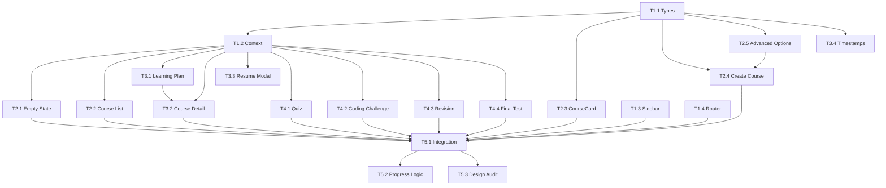

# My Courses Ecosystem — Low-Fidelity Implementation Plan

> **Project:** SmartLearn AI (CodeCrux)  
> **Module:** My Courses Ecosystem + Learning Flow  
> **Platform:** Desktop Web (Vite + React 19 + Tailwind CDN)  
> **Project Type:** WEB  
> **Primary Agent:** `frontend-specialist`  
> **Date:** 2026-05-25

---

## 1. Overview

Transform the existing basic `MyCourses.tsx` screen into a complete **AI-powered learning ecosystem** where users create courses from YouTube URLs, follow AI-generated learning plans, take quizzes, solve coding challenges, do revisions, and sit for proctored final tests.

### What Exists Today

| Asset | Status | Notes |
|-------|--------|-------|
| [MyCourses.tsx](file:///c:/Users/pvenk/Downloads/CodeCrux/CodeCrux/screens/MyCourses.tsx) | ✅ Exists | Basic grid/empty state, stats strip, tab filters. Needs major refactor. |
| [CourseCard.tsx](file:///c:/Users/pvenk/Downloads/CodeCrux/CodeCrux/components/Dashboard/CourseCard.tsx) | ✅ Exists | Simple card with progress bar. Needs expansion for quiz/coding/revision badges. |
| [CreateCourseModal.tsx](file:///c:/Users/pvenk/Downloads/CodeCrux/CodeCrux/components/Dashboard/CreateCourseModal.tsx) | ✅ Exists | Has YouTube URL input, category picker, date, difficulty. Needs Advanced Options modal. |
| [CourseLearning.tsx](file:///c:/Users/pvenk/Downloads/CodeCrux/CodeCrux/screens/CourseLearning.tsx) | ✅ Exists | Video player + sidebar + notes/lab/AI tutor. Re-usable for module views. |
| [Quiz.tsx](file:///c:/Users/pvenk/Downloads/CodeCrux/CodeCrux/screens/Quiz.tsx) | ✅ Exists | MCQ quiz with timer. Needs Question Navigator panel. |
| [PracticeLab.tsx](file:///c:/Users/pvenk/Downloads/CodeCrux/CodeCrux/screens/PracticeLab.tsx) | ✅ Exists | Code editor with preview. Can be adapted for Coding Challenge screen. |
| [Sidebar.tsx](file:///c:/Users/pvenk/Downloads/CodeCrux/CodeCrux/components/Layout/Sidebar.tsx) | ✅ Exists | Fixed left nav. Needs new items from PRD. |
| [types.ts](file:///c:/Users/pvenk/Downloads/CodeCrux/CodeCrux/types.ts) | ✅ Exists | Has `Course`, `Module`, `QuizQuestion` etc. Needs extension. |
| [App.tsx](file:///c:/Users/pvenk/Downloads/CodeCrux/CodeCrux/App.tsx) | ✅ Exists | Hash-based routing. New routes needed. |

### What Needs to Be Built

| Screen | PRD # | Existing Base | Effort |
|--------|-------|---------------|--------|
| My Courses Empty State | Screen 1 | `MyCourses.tsx` (partial) | 🟡 Modify |
| My Courses With Courses | Screen 2 | `MyCourses.tsx` (partial) | 🟡 Modify |
| Create Course | Screen 3 | `CreateCourseModal.tsx` (partial) | 🟡 Modify |
| Advanced Options Modal | Screen 4 | ❌ None | 🔴 New |
| View Full Learning Plan | Screen 5 | ❌ None | 🔴 New |
| Course Detailed View | Screen 6 | ❌ None | 🔴 New |
| Resume Learning Modal | Screen 7 | ❌ None | 🔴 New |
| Quiz Screen (enhanced) | Screen 8 | `Quiz.tsx` (partial) | 🟡 Modify |
| Coding Challenge Screen | Screen 9 | `PracticeLab.tsx` (partial) | 🔴 New |
| Revision Screen | Screen 10 | ❌ None | 🔴 New |
| Final Test Screen | Screen 11 | ❌ None | 🔴 New |

---

## 2. User Review Required

> [!IMPORTANT]
> **Design System Alignment:** The PRD specifies `border-radius: 12px/10px/8px` and specific spacing tokens (XS=8, S=16, M=24, L=32, XL=48). The existing codebase uses Tailwind defaults (e.g. `rounded-2xl` = 16px, `rounded-xl` = 12px). I'll map PRD values to the closest Tailwind classes. Let me know if you want exact pixel overrides instead.

> [!IMPORTANT]
> **Sidebar PRD Items:** The PRD lists **11 sidebar items** (Dashboard, My Courses, Create Course, Learning Plan, Modules, Quiz, Coding Challenge, Revision, Final Test, Results, Settings). Currently the sidebar has 6 student items. Adding all 11 would crowd the nav. I recommend grouping them as:
> - **MAIN:** Dashboard, My Courses
> - **LEARNING:** Modules, Quiz, Coding Challenge
> - **REVIEW:** Revision, Final Test, Results
> - **OTHERS:** Settings
>
> The "Create Course" and "Learning Plan" would be accessible from within the My Courses screen rather than top-level sidebar items. **Please confirm this grouping approach.**

> [!WARNING]
> **Proctoring in Final Test:** The PRD requires strict proctoring (face detection, tab switching, eye movement, multiple person detection, microphone). The existing `ProctoringWidget` and `FloatingWebcam` components handle face detection + tab switching. Eye movement and microphone monitoring would be new. For the **low-fidelity** phase, I recommend mocking these with visual indicators and implementing actual detection in a later phase.

---

## 3. Open Questions

> [!IMPORTANT]
> 1. **Data Persistence:** The current app uses mock data with `useState`. Should I keep this pattern for the lo-fi phase or introduce localStorage/context for cross-screen state (e.g., resume progress)?
> 2. **YouTube Metadata Extraction:** The PRD says "Extract timestamps" — should the lo-fi version show hardcoded mock timestamps, or integrate the YouTube Data API?
> 3. **Color Palette for Primary CTA:** PRD says "Background: Dark" for primary buttons. Current primary is `#c3f53c` (lime green) with dark text. Should primary CTAs be dark (`bg-charcoal text-white`) or keep the existing lime green pattern?
> 4. **Course Detail as full page vs. modal:** Should Screen 6 (Course Detailed View) be a full page route (`/course/:id`) or a slide-over panel/modal from the My Courses grid?

---

## 4. Tech Stack

| Layer | Technology | Rationale |
|-------|-----------|-----------|
| Framework | React 19 + Vite | Already in use |
| Styling | Tailwind CSS (CDN) | Already configured in `index.html` |
| Icons | Lucide React | Already in use, comprehensive icon set |
| Fonts | Outfit, Space Grotesk, Fira Code | Already loaded |
| State | React `useState` + `useContext` | Lo-fi phase — mock data, context for cross-screen sharing |
| Code Editor | Existing `CodeEditor` component | Reuse from Lab module |
| Video | YouTube iframe embed | No custom player needed |

---

## 5. File Structure

```
CodeCrux/
├── types.ts                                    # [MODIFY] Add new interfaces
├── App.tsx                                     # [MODIFY] Add new routes
├── components/
│   ├── Layout/
│   │   └── Sidebar.tsx                         # [MODIFY] Update nav items
│   ├── Dashboard/
│   │   ├── CourseCard.tsx                       # [MODIFY] Add progress badges
│   │   └── CreateCourseModal.tsx               # [MODIFY] Refine for PRD
│   └── MyCourses/                              # [NEW] Component group
│       ├── AdvancedOptionsModal.tsx             # [NEW] Screen 4
│       ├── LearningPlanView.tsx                 # [NEW] Screen 5
│       ├── CourseDetailView.tsx                 # [NEW] Screen 6
│       ├── ResumeLearningModal.tsx              # [NEW] Screen 7
│       ├── ModuleCard.tsx                       # [NEW] Module timeline card
│       ├── CourseProgressBadges.tsx             # [NEW] Quiz/Code/Revision status
│       └── TimestampBreakdown.tsx              # [NEW] Video timestamp UI
├── screens/
│   ├── MyCourses.tsx                           # [MODIFY] Full refactor
│   ├── CourseDetail.tsx                        # [NEW] Screen 6 page
│   ├── QuizEnhanced.tsx                        # [NEW] Screen 8 with Navigator
│   ├── CodingChallenge.tsx                     # [NEW] Screen 9
│   ├── RevisionScreen.tsx                      # [NEW] Screen 10
│   └── FinalTest.tsx                           # [NEW] Screen 11
└── services/
    └── courseContext.tsx                        # [NEW] Shared course state
```

---

## 6. Proposed Type Extensions

```typescript
// New types for types.ts

export type CourseStatus = 'not_started' | 'in_progress' | 'completed' | 'paused';

export interface SmartCourse {
  id: string;
  title: string;
  youtubeUrl: string;
  thumbnail: string;
  duration: string;
  startDate: Date;
  status: CourseStatus;
  progress: number; // calculated
  
  // AI-generated structure
  modules: SmartModule[];
  learningPlan: LearningPlan;
  
  // Preferences
  dailyLearningTime: number; // hours
  difficulty: 'Easy' | 'Medium' | 'Hard';
  language: string;
  contentPreferences: ContentPreference[];
  includes: IncludeOption[];
}

export interface SmartModule {
  id: string;
  day: number;
  title: string;
  duration: string;
  status: 'locked' | 'current' | 'completed';
  
  // Content
  videoTimestamps: Timestamp[];
  quiz: ModuleQuiz | null;
  codingChallenge: ModuleCodingChallenge | null;
  summaryNotes: string;
}

export interface Timestamp {
  time: string;    // "05:30"
  seconds: number; // 330
  label: string;   // "Variables"
}

export interface LearningPlan {
  totalDuration: string;
  learningDays: number;
  dailyTime: string;
  totalModules: number;
  totalQuizzes: number;
  totalChallenges: number;
  totalRevisions: number;
}

export interface ModuleQuiz {
  id: string;
  questions: QuizQuestion[];
  timeLimit: number; // seconds
  completed: boolean;
  score: number | null;
}

export interface ModuleCodingChallenge {
  id: string;
  title: string;
  difficulty: 'Easy' | 'Medium' | 'Hard';
  problemStatement: string;
  starterCode: string;
  language: string;
  testCases: TestCase[];
  completed: boolean;
  passed: boolean;
}

export type ContentPreference = 'basics' | 'advanced' | 'projects' | 'interview';
export type IncludeOption = 'quizzes' | 'coding' | 'revision' | 'final_test';

export interface RevisionItem {
  id: string;
  moduleId: string;
  question: string;
  weakArea: boolean;
  topic: string;
}

export interface ProctoringViolation {
  type: 'minor' | 'repeated' | 'high_risk';
  reason: string;
  timestamp: Date;
}
```

---

## 7. Task Breakdown

### Phase 1: Foundation (Types + Context + Sidebar)

---

#### Task 1.1: Extend Type Definitions
- **Agent:** `frontend-specialist`
- **Skills:** `clean-code`
- **Priority:** P0 (blocker for all other tasks)
- **Dependencies:** None
- **INPUT:** Current `types.ts` with basic `Course`, `Module`, `QuizQuestion`
- **OUTPUT:** Extended `types.ts` with `SmartCourse`, `SmartModule`, `Timestamp`, `LearningPlan`, `ModuleQuiz`, `ModuleCodingChallenge`, `RevisionItem`, `ProctoringViolation`
- **VERIFY:** TypeScript compiles with `npx tsc --noEmit`

---

#### Task 1.2: Create Course Context
- **Agent:** `frontend-specialist`
- **Skills:** `react-best-practices`
- **Priority:** P0
- **Dependencies:** Task 1.1
- **INPUT:** Need shared state for courses across screens
- **OUTPUT:** `services/courseContext.tsx` with `CourseProvider`, `useCourses` hook, mock course data
- **VERIFY:** Context can be consumed from any screen

---

#### Task 1.3: Update Sidebar Navigation
- **Agent:** `frontend-specialist`
- **Skills:** `frontend-design`
- **Priority:** P1
- **Dependencies:** None
- **INPUT:** Current `Sidebar.tsx` with 6 student items
- **OUTPUT:** Updated sidebar with PRD-required sections (MAIN, LEARNING, REVIEW, OTHERS)
- **VERIFY:** All sidebar items render, correct paths, active state works

---

#### Task 1.4: Update App Router
- **Agent:** `frontend-specialist`
- **Skills:** `react-best-practices`
- **Priority:** P1
- **Dependencies:** Task 1.2
- **INPUT:** Current `App.tsx` with existing routes
- **OUTPUT:** New routes: `/courses`, `/course/:id`, `/course/:id/quiz`, `/course/:id/coding`, `/revision`, `/final-test`
- **VERIFY:** Navigation works between all new screens

---

### Phase 2: My Courses Screens (1, 2, 3, 4)

---

#### Task 2.1: Refactor MyCourses Empty State (Screen 1)
- **Agent:** `frontend-specialist`
- **Skills:** `frontend-design`
- **Priority:** P2
- **Dependencies:** Task 1.1, 1.2
- **INPUT:** PRD Screen 1 spec + user's lo-fi wireframe showing book icon, "No Courses Yet" text, "Create Your First Course" CTA
- **OUTPUT:** Empty state with centered illustration, heading, description, primary CTA button
- **VERIFY:** Empty state shows when `courses.length === 0`, CTA navigates to Create Course

---

#### Task 2.2: Refactor MyCourses With Courses (Screen 2)
- **Agent:** `frontend-specialist`
- **Skills:** `frontend-design`
- **Priority:** P2
- **Dependencies:** Task 1.1, 1.2
- **INPUT:** PRD Screen 2 spec + wireframe showing search, status filter, list/grid toggle, course cards with full metadata
- **OUTPUT:** Updated screen with:
  - Header ("My Courses" + "Create Course" button)
  - Search bar with real-time filtering
  - Status filter tabs (All, In Progress, Completed, Not Started, Paused)
  - Grid/List view toggle
  - Sort dropdown ("Recent First")
  - Enhanced course cards with: thumbnail, title, duration, start date, progress bar, modules completed, quiz/coding/revision completion badges, status badge
- **VERIFY:** Search filters courses, tab filters work, grid/list toggle works, cards show all metadata

---

#### Task 2.3: Enhance CourseCard Component
- **Agent:** `frontend-specialist`
- **Skills:** `frontend-design`, `clean-code`
- **Priority:** P2
- **Dependencies:** Task 1.1
- **INPUT:** Current `CourseCard.tsx` with basic progress
- **OUTPUT:** Enhanced card with:
  - Progress bar with percentage
  - Module completion count
  - Quiz/Coding/Revision status badges
  - Status badge (In Progress / Completed / Paused / Not Started)
  - Click navigates to Course Detail
- **VERIFY:** All badges render with correct mock data

---

#### Task 2.4: Refine Create Course Screen (Screen 3)
- **Agent:** `frontend-specialist`
- **Skills:** `frontend-design`
- **Priority:** P2
- **Dependencies:** Task 1.1
- **INPUT:** PRD Screen 3 — YouTube URL, Daily Learning Time, Start Date, Learning Goal, Advanced Options, Analyze button
- **OUTPUT:** Updated `CreateCourseModal.tsx` or standalone `CreateCourse` screen with:
  - YouTube URL input with validation
  - Daily learning time slider
  - Start date picker
  - Learning goal text input (new)
  - "Advanced Options" button → opens Advanced Options Modal
  - "Analyze & Create Course" CTA with loading states (8-step progress: analyze → extract metadata → timestamps → modules → quizzes → coding → schedule → save)
- **VERIFY:** URL validation works, all fields functional, loading animation plays

---

#### Task 2.5: Build Advanced Options Modal (Screen 4)
- **Agent:** `frontend-specialist`
- **Skills:** `frontend-design`
- **Priority:** P2
- **Dependencies:** Task 1.1
- **INPUT:** PRD Screen 4 — checkboxes for content prefs, include options, difficulty selector, language selector
- **OUTPUT:** `components/MyCourses/AdvancedOptionsModal.tsx` with:
  - Content Preferences section (Basics, Advanced, Projects, Interview Questions — checkboxes)
  - Include section (Quizzes, Coding Challenges, Revision, Final Test — toggle checkboxes)
  - Difficulty selector (Easy/Medium/Hard radio)
  - Language dropdown
  - Cancel + Save & Analyze buttons
- **VERIFY:** Modal opens/closes, selections persist, integrates with Create Course flow

---

### Phase 3: Learning Plan + Course Detail (5, 6, 7)

---

#### Task 3.1: Build Learning Plan View (Screen 5)
- **Agent:** `frontend-specialist`
- **Skills:** `frontend-design`
- **Priority:** P2
- **Dependencies:** Task 1.1, 1.2
- **INPUT:** PRD Screen 5 — metrics bar + module timeline
- **OUTPUT:** `components/MyCourses/LearningPlanView.tsx` (full page or modal):
  - Top metrics row: Total Duration, Learning Days, Daily Time, Modules, Quizzes, Challenges, Revisions
  - Module timeline: collapsible day-by-day breakdown
  - Each day shows: Video Learning, Quiz, Coding Challenge, Notes
  - Expand/collapse per module
  - "Start Learning" CTA navigates to first module
- **VERIFY:** Metrics calculate from mock data, timeline renders all modules, expand/collapse works

---

#### Task 3.2: Build Course Detail View (Screen 6)
- **Agent:** `frontend-specialist`
- **Skills:** `frontend-design`
- **Priority:** P2
- **Dependencies:** Task 1.1, 1.2, 3.1
- **INPUT:** PRD Screen 6 — top section (thumbnail, title, duration, progress) + tabbed content
- **OUTPUT:** `screens/CourseDetail.tsx`:
  - Hero: thumbnail, title, duration, overall progress bar
  - Tabs: Learning Plan | Modules | Quiz | Coding Challenge | Revision | Notes
  - "Resume Learning" CTA → opens Resume Learning Modal
  - "View Full Plan" → opens Learning Plan View
  - Each tab shows relevant filtered content
- **VERIFY:** Tab switching works, all tabs render content, CTAs navigate correctly

---

#### Task 3.3: Build Resume Learning Modal (Screen 7)
- **Agent:** `frontend-specialist`
- **Skills:** `frontend-design`
- **Priority:** P2
- **Dependencies:** Task 1.2
- **INPUT:** PRD Screen 7 — current day, remaining activities checklist, Cancel + Resume buttons
- **OUTPUT:** `components/MyCourses/ResumeLearningModal.tsx`:
  - Shows current day number
  - Checklist of remaining activities (Video, Quiz, Coding, Summary) with completion status
  - Cancel button (closes modal)
  - Resume Now button → navigates to the first unfinished activity
- **VERIFY:** Modal shows correct current activity, Resume navigates to right screen

---

#### Task 3.4: Build Timestamp Breakdown Component
- **Agent:** `frontend-specialist`
- **Skills:** `frontend-design`
- **Priority:** P3
- **Dependencies:** Task 1.1
- **INPUT:** PRD Module Structure — list of timestamps with labels
- **OUTPUT:** `components/MyCourses/TimestampBreakdown.tsx`:
  - Vertical list of timestamps (00:00 Introduction, 05:30 Variables, etc.)
  - Clickable timestamps with hover effect
  - Click handler jumps to video position (via YouTube iframe API or URL param)
- **VERIFY:** Timestamps render, click handler fires with correct seconds value

---

### Phase 4: Interactive Screens (8, 9, 10, 11)

---

#### Task 4.1: Enhanced Quiz Screen (Screen 8)
- **Agent:** `frontend-specialist`
- **Skills:** `frontend-design`
- **Priority:** P2
- **Dependencies:** Task 1.1, 1.2
- **INPUT:** PRD Screen 8 — 3-column layout (question | options | navigator), timer, prev/next/finish
- **OUTPUT:** `screens/QuizEnhanced.tsx`:
  - Left panel: Question text
  - Center: Answer options (radio buttons)
  - Right panel: Question Navigator (numbered grid, color-coded: answered/current/unanswered/flagged)
  - Top: Timer bar
  - Bottom: Previous | Next | Finish Quiz buttons
  - Auto-submit on timer expiry
- **VERIFY:** Navigation between questions works, navigator highlights current, timer auto-submits

---

#### Task 4.2: Coding Challenge Screen (Screen 9)
- **Agent:** `frontend-specialist`
- **Skills:** `frontend-design`
- **Priority:** P2
- **Dependencies:** Task 1.1, 1.2
- **INPUT:** PRD Screen 9 — 3-column layout (problem | editor | test results)
- **OUTPUT:** `screens/CodingChallenge.tsx`:
  - Left panel: Problem statement (markdown)
  - Center: Code editor (reuse `CodeEditor` component)
  - Right panel: Test results (pass/fail per test case, hidden tests on submit)
  - Buttons: Run Code (compile only) | Submit (hidden tests) | Reset (restore starter code)
- **VERIFY:** Editor renders, Run shows visible test results, Submit shows all results, Reset restores starter

---

#### Task 4.3: Revision Screen (Screen 10)
- **Agent:** `frontend-specialist`
- **Skills:** `frontend-design`
- **Priority:** P2
- **Dependencies:** Task 1.1, 1.2
- **INPUT:** PRD Screen 10 — revision questions, weak areas, suggested topics, coding practice
- **OUTPUT:** `screens/RevisionScreen.tsx`:
  - Section: Revision Questions (flashcard-style Q&A)
  - Section: Weak Areas (visual indicators of topics needing more practice)
  - Section: Suggested Review Topics (based on quiz/coding performance)
  - Section: Coding Practice (mini-challenges from failed concepts)
  - Start Revision CTA + View Weak Areas CTA
- **VERIFY:** All sections render with mock data, CTAs trigger navigation

---

#### Task 4.4: Final Test Screen (Screen 11)
- **Agent:** `frontend-specialist`
- **Skills:** `frontend-design`
- **Priority:** P2
- **Dependencies:** Task 1.1, 1.2
- **INPUT:** PRD Screen 11 — proctored exam with violation handling
- **OUTPUT:** `screens/FinalTest.tsx`:
  - Full-screen exam mode (similar to `LiveExam.tsx`)
  - Proctoring indicators: face detection, tab switching, eye movement (mocked), multiple person detection (mocked), microphone activity (mocked)
  - Violation handling:
    - Minor → Warning popup
    - Repeated → Stop exam warning
    - High Risk → Terminate exam with "Return after 24 hours" message
  - "Reattempt After 24 Hours" button (disabled with countdown)
- **VERIFY:** Exam renders, mock violations trigger correct UI responses, termination message shows

---

### Phase 5: Integration + Polish

---

#### Task 5.1: Wire All Screens Together
- **Agent:** `frontend-specialist`
- **Skills:** `react-best-practices`
- **Priority:** P1
- **Dependencies:** All Phase 2-4 tasks
- **INPUT:** All screens built independently
- **OUTPUT:** 
  - All routes registered in `App.tsx`
  - Navigation flow works end-to-end
  - Course context wraps all screens
  - Progress updates correctly as user completes activities
- **VERIFY:** Full user journey: Create → View Plan → Start Module → Quiz → Coding → Revision → Final Test

---

#### Task 5.2: Progress Calculation Logic
- **Agent:** `frontend-specialist`
- **Skills:** `clean-code`
- **Priority:** P2
- **Dependencies:** Task 1.2
- **INPUT:** PRD progress formula: `(completed modules + completed quizzes + completed coding) / total items`
- **OUTPUT:** Progress calculation function in courseContext, auto-updates on activity completion
- **VERIFY:** Progress bar reflects correct percentage after mock completions

---

#### Task 5.3: Design System Consistency Pass
- **Agent:** `frontend-specialist`
- **Skills:** `frontend-design`
- **Priority:** P3
- **Dependencies:** All screens built
- **INPUT:** PRD Design System: 12px/10px/8px border-radius, spacing tokens, button styles, card styles
- **OUTPUT:** Audit all components for consistency; ensure:
  - Primary cards = `rounded-xl` (12px)
  - Secondary cards = `rounded-[10px]`
  - Buttons = `rounded-lg` (8px)
  - Input fields = `rounded-lg` (8px)
  - Consistent shadow, padding, margin
- **VERIFY:** Visual audit of all screens matches PRD design tokens

---

## 8. Dependency Graph



---

## 9. Screen-to-Task Mapping

| PRD Screen | Task(s) | Route |
|-----------|---------|-------|
| Screen 1 — Empty State | T2.1 | `/courses` (when empty) |
| Screen 2 — With Courses | T2.2, T2.3 | `/courses` |
| Screen 3 — Create Course | T2.4 | `/courses` (modal or `/create-course`) |
| Screen 4 — Advanced Options | T2.5 | Modal overlay |
| Screen 5 — Learning Plan | T3.1 | `/course/:id/plan` or modal |
| Screen 6 — Course Detail | T3.2 | `/course/:id` |
| Screen 7 — Resume Modal | T3.3 | Modal overlay |
| Screen 8 — Quiz | T4.1 | `/course/:id/quiz/:quizId` |
| Screen 9 — Coding Challenge | T4.2 | `/course/:id/coding/:challengeId` |
| Screen 10 — Revision | T4.3 | `/revision` |
| Screen 11 — Final Test | T4.4 | `/final-test/:courseId` |

---

## 10. Phase X: Verification Checklist

- [ ] TypeScript compiles: `npx tsc --noEmit`
- [ ] Vite builds: `npm run build`
- [ ] Dev server runs: `npm run dev`
- [ ] All 11 PRD screens are accessible
- [ ] Navigation between screens works
- [ ] Empty state displays when no courses
- [ ] Course cards show all required metadata
- [ ] Create course flow works end-to-end
- [ ] Advanced options modal saves preferences
- [ ] Learning plan renders with mock data
- [ ] Course detail tabs switch correctly
- [ ] Resume modal shows correct current activity
- [ ] Quiz screen has question navigator
- [ ] Coding challenge has run/submit/reset
- [ ] Revision screen shows weak areas
- [ ] Final test has proctoring indicators
- [ ] Progress calculation is correct
- [ ] Design tokens match PRD spec
- [ ] No Tailwind console errors
- [ ] No purple/violet hex codes
- [ ] Socratic Gate was respected

---

## 11. Estimated Effort (Lo-Fi)

| Phase | Tasks | Estimated Time |
|-------|-------|---------------|
| Phase 1: Foundation | 4 tasks | ~30 min |
| Phase 2: My Courses Screens | 5 tasks | ~60 min |
| Phase 3: Learning + Detail | 4 tasks | ~45 min |
| Phase 4: Interactive Screens | 4 tasks | ~60 min |
| Phase 5: Integration + Polish | 3 tasks | ~30 min |
| **Total** | **20 tasks** | **~3.5 hrs** |

---

## 12. Rollback Strategy

Each phase produces independently verifiable output:
- **Phase 1 failure:** Revert types.ts to original, remove new files
- **Phase 2 failure:** Original MyCourses.tsx is preserved until final replacement
- **Phase 3-4 failure:** New screens are isolated files — delete to rollback
- **Phase 5 failure:** Revert App.tsx route additions, Sidebar.tsx changes

All existing screens remain untouched until Phase 5 wiring.
